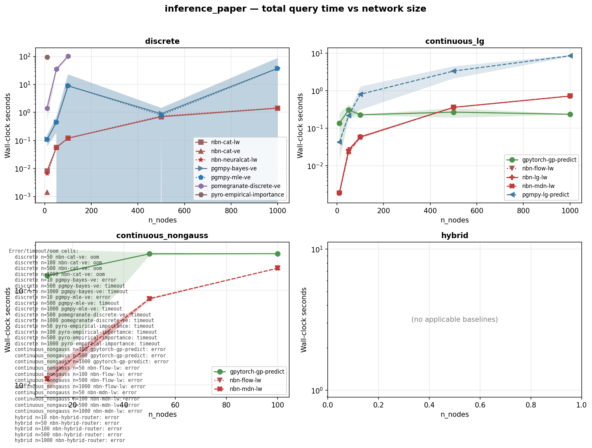
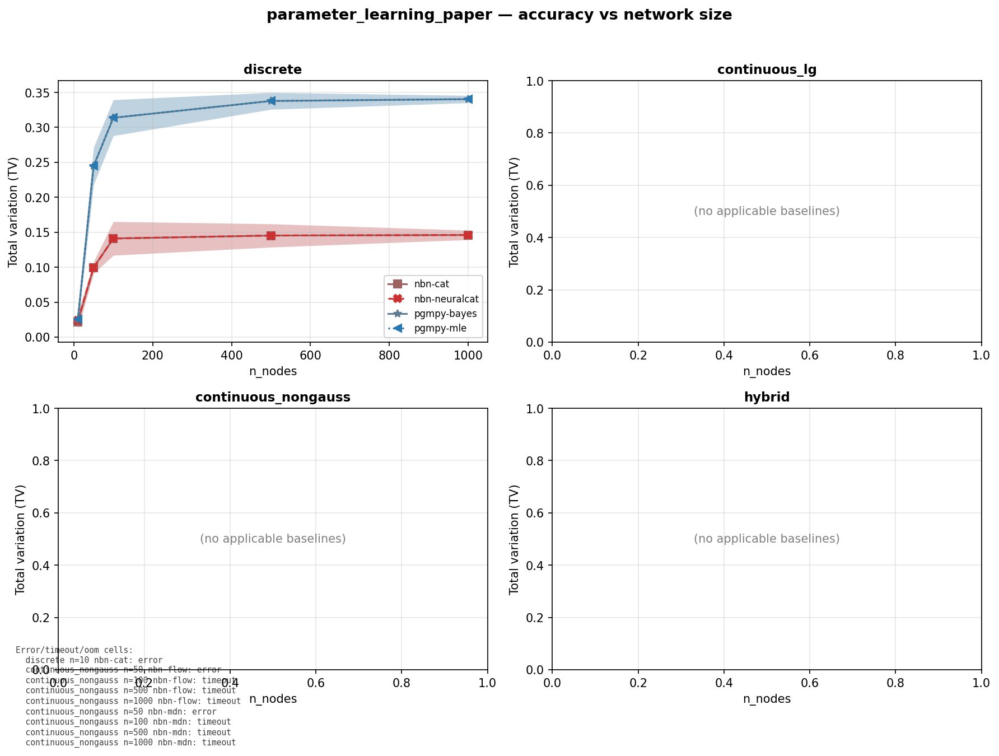

# NeuralBayesianNetworks (NBN)

A PyTorch-native Bayesian network library where each mechanism is learnt
by a neural network. Every node carries a learnable, batched, GPU-resident
conditional distribution; every query is a batched tensor operation;
inference and parameter learning both run end-to-end on cuda.

NBN is **9-22× faster** than pgmpy on continuous Linear Gaussian inference
and **2.3× more accurate** on discrete parameter learning at scale, and is
the only library in our benchmark suite that handles hybrid (mixed
continuous-discrete) networks at scale.

## Why NBN

NBN is to Bayesian Networks what GPyTorch is to Gaussian Processes:
a torch-native, batchable, autograd-friendly framework where every
conditional distribution is a swappable, learnable module, and every
query is a batched tensor operation.

| Library         | Discrete BN  | Continuous       | Batched queries | Neural CPDs | Hybrid native |
|-----------------|:------------:|:----------------:|:---------------:|:-----------:|:-------------:|
| pgmpy           | ✅ exact     | ✅ Gaussian only | ❌              | ❌          | ⚠️ CG only    |
| pomegranate     | ✅           | ✅               | partial         | ❌          | ⚠️ limited    |
| GPyTorch        | ❌           | ✅ GP            | ✅              | ✅          | ❌            |
| Pyro / NumPyro  | ✅ via enum  | ✅               | partial         | ✅          | ✅ universal  |
| **NBN**         | **✅ exact** | **✅ MDN/Flow/GP** | **✅ batched VE** | **✅** | **✅ native** |

## Headline results

These numbers come from the canonical paper-data run at tag `v0.6c-d`
(see [Reproducibility](#reproducibility) below).

### Inference: 9-22× faster on continuous Linear Gaussian networks



NBN-lg-lw vs pgmpy-lg-predict on continuous Linear Gaussian networks:
22× faster at n=10 (1.9 ms vs 42 ms), 12× at n=1000 (0.72 s vs 8.5 s).
Accuracy matches pgmpy within 0.02 W₁ at every n_nodes — speed gain
comes without quality regression.

On discrete networks at n=10, NBN-cat-ve runs at 1.4 ms vs pgmpy-mle-ve
at 108 ms (75× faster).

### Parameter learning: 2.3× more accurate on discrete networks at scale



On discrete Bayesian networks, NBN-cat reaches TV ≈ 0.14 across all
n_nodes ≥ 50; pgmpy-mle saturates at TV ≈ 0.34. The quality gap opens
at n=50 (0.10 vs 0.25) and persists through n=1000 (0.146 vs 0.340).
NBN's gradient-based fitting scales past pgmpy's sample-complexity wall.

On continuous Linear Gaussian networks, NBN matches pgmpy quality
(W₁ ≈ 0.083 across all n) at 2× the speed.

### Hybrid networks

NBN-hybrid handles mixed continuous-discrete networks across all n_nodes
in our benchmark (n ∈ {10, 50, 100, 500, 1000}). No other library in the
suite (pgmpy, gpytorch, pomegranate, pyro) has applicable parameter-learning
or inference baselines for hybrid family.

## Install

    pip install -e ".[dev,bench,neural]"

## Quick start

```python
import torch
from nbn import NeuralBayesianNetwork, TensorVariableElimination
from nbn.mechanisms import CategoricalTableMechanism

# A → B → C, all categorical with cardinality 4
edges = [("A", "B"), ("B", "C")]
model = NeuralBayesianNetwork(
    edges,
    variables={"A": ("discrete", 4), "B": ("discrete", 4), "C": ("discrete", 4)},
)

# Fit each node's mechanism from data
data = {"A": torch.randint(0, 4, (10_000,)),
        "B": torch.randint(0, 4, (10_000,)),
        "C": torch.randint(0, 4, (10_000,))}
for node in model.dag.topological_order():
    parents = model.dag.parents(node)
    pa = torch.stack([data[p] for p in parents], dim=-1).float() if parents else None
    mech = CategoricalTableMechanism()
    mech.fit_local(data[node], pa, parent_cards=[4] * len(parents))
    model.set_mechanism(node, mech)

# Batched query: P(C | A=a) for 4 evidence rows at once
engine = TensorVariableElimination()
posterior = engine.query_batch(model, ["C"], {"A": torch.tensor([0, 1, 2, 3])})
# posterior shape: (B=4, 1, 4) — a distribution over C for each evidence row
```

For continuous, hybrid, and neural-mechanism examples, see the test suite
under `tests/integration/`.

## Repository layout

    nbn/                Library code (mechanisms, inference, sampling, core).
    benchmarking/       Crash-test runner, baselines, configs, output figures.
    tests/              Unit + integration tests.
    RESEARCH.md         Paper outline and contribution claims.

## Reproducibility

The headline numbers above are anchored at tag `v0.6c-d`
(commit `2e0dd32`):

```bash
git checkout v0.6c-d
nbn-bench inference \
  --config benchmarking/configs/inference_paper_laptop.yaml
nbn-bench param-learning \
  --config benchmarking/configs/parameter_learning_paper_laptop.yaml
```

- **Hardware**: NVIDIA GeForce RTX 4070 Laptop (8 GB VRAM)
- **PyTorch**: 2.11.0+cu130
- **Wall time**: 11.4 h inference + 6.5 h parameter-learning
- **Paper data anchor**: see [`docs/v0.6c-d/run_summary.md`](docs/v0.6c-d/run_summary.md) for full headline tables and [`docs/v0.6c-d/dnf_cells.md`](docs/v0.6c-d/dnf_cells.md) for the DNF table

Numerical values vary within MC noise across hardware; STATUS counts
and qualitative findings (cluster, speedup, quality gap) are stable.
The committed parquets, tables, and figures under
`benchmarking/results/{raw,tables,figures}/` are the canonical paper
artefacts.

## Crash tests

NBN ships two crash tests on synthetic Bayesian networks with **known
ground truth**, sweeping network size on the x-axis:

1. **Parameter-learning crash test** — measures accuracy of fitted CPDs
   against the true generative process. Speed is not measured.
2. **Inference crash test** — measures both accuracy and total time for
   `Q` conditional queries. NBN uses `query_batch(B=Q)` (one batched
   call); other libraries loop over the same `Q` queries in Python.

Each crash test has a smoke config (CI, < 60s) and a paper config
(local reproduction, ~17.9 h on RTX 4070 Laptop 8 GB; CPU not supported for paper-config).

### Reproduce

```bash
# Smoke (runs in CI):
nbn-bench param-learning --config benchmarking/configs/parameter_learning_smoke.yaml
nbn-bench inference      --config benchmarking/configs/inference_smoke.yaml

# Paper (8 GB VRAM, the laptop variant used for v0.6c-d paper data):
nbn-bench param-learning --config benchmarking/configs/parameter_learning_paper_laptop.yaml
nbn-bench inference      --config benchmarking/configs/inference_paper_laptop.yaml

# Paper (≥16 GB VRAM, canonical config without batch reductions):
nbn-bench param-learning --config benchmarking/configs/parameter_learning_paper.yaml
nbn-bench inference      --config benchmarking/configs/inference_paper.yaml
```

Each invocation writes its output under `benchmarking/results/`:

    benchmarking/results/figures/{prefix}_total_time_vs_size.{pdf,svg,png}
    benchmarking/results/figures/{prefix}_accuracy_vs_size.{pdf,svg,png}
    benchmarking/results/raw/{prefix}_metrics.parquet
    benchmarking/results/raw/{prefix}_{timestamp}.log         (gitignored)
    benchmarking/results/raw/{prefix}_{timestamp}.run.json    (gitignored)
    benchmarking/results/tables/{prefix}_summary.{csv,md,parquet,tex}

## Configuration

Each config is a YAML file with these fields:

    mode:                 'parameter_learning' | 'inference'
    families:             list of families ∈ {discrete, continuous_lg,
                          continuous_nongauss, hybrid}
    n_nodes:              list of network sizes
    n_seeds:              number of seeds per cell (mean ± std reported)
    n_queries_per_cell:   number of queries per cell
    nbn_batch_size:       B for NBN's query_batch (inference mode only)
    baselines:            list of baseline names
    per_cell_timeout_s:   wall-clock cap per (family, n_nodes, seed, baseline)

See `benchmarking/configs/*.yaml` for all four shipped configs.

## Status

Current release: **v0.6c-d** (paper-data anchor). The library is in
publishable empirical state.

| Component | Status |
| --- | --- |
| Core (DAG, Variables, Factor) | ✅ |
| Mechanisms (Categorical, NeuralCategorical, LG, MDN, Flow, GP, Hybrid) | ✅ |
| Tensor VE + LW + HybridRouter | ✅ |
| Vectorised batched `query_batch` | ✅ |
| Synthetic crash-test framework | ✅ |
| Method-keyed baseline registry | ✅ v0.6c-C |
| Aggregator + tables (CSV/MD/parquet/TEX) | ✅ v0.6c-C-3 |
| Paper-grade figures + paper-data anchor | ✅ v0.6c-d |
| Multi-library baselines (pgmpy, gpytorch, pomegranate, pyro) | ✅ |
| README enrichment | ✅ v0.6d |

Active backlog (v0.7, none paper-blocking):

- Plotter polish: W₁ band lower-clip (#42), parameter-learning accuracy panels for non-discrete families (#44)
- Adapter audits: pgmpy-mle vs pgmpy-bayes / nbn-cat vs nbn-neuralcat fit-path distinctness (#43)
- HybridRouter cuda assert at hybrid n ≥ 10 (#30)
- NeuralCategorical-VE engine refactor (#26)
- pyro paper-config timeout (#36)

See the [open issues](https://github.com/Giovannibriglia/NeuralBayesianNetworks/issues) for the full v0.7 backlog.

## License

Apache 2.0.
